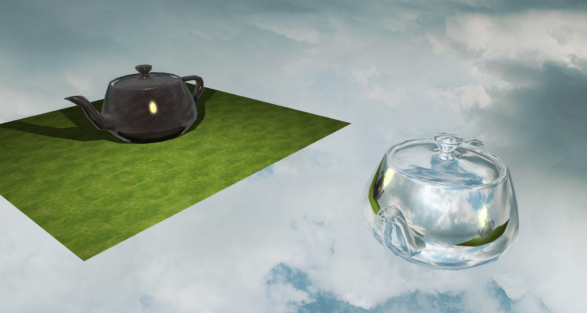

# Introduction
Mathics is a single-threaded CPU rasterizer made as part of CS 334 in Fall 2022 at Purdue University. It is capable of rendering roughly 3,000 triangles at a 1000 × 600 resolution, while achieving about 15 frames per second. This project makes heavy use of C++ modules and other modern C++ features.

# Screenshots

# Features
* Templated `Vector` and `Matrix` classes for doing linear algebra.
* Collection of over 900 named color constants located in `color.cpp`.
* `PinholeCamera` class for projecting and unprojecting points. Supports various forms of manipulating the camera position/rotation.
* Reasonably fast rasterization routine with subpixel precision to avoid visual artifacts.
* Screen-space interpolation of vertex colors and normals and model-space interpolation of texture coordinates.
* 2-phase rendering where z-buffering gets done first in order to run the shader code at most once per pixel.
* Back-face culling.
* `TriangleMesh` class which can either be constructed from a few basic shapes (triangles, quads, etc.) or be loaded from a file.
* Cube mapping which supports shadow mapping, reflections, and skyboxes.
* Point and directional light sources (directional light sources don't support shadow mapping).
* Bilinear interpolation for texture lookup and shadow mapping.
* A shader which supports ambient, diffuse, and specular lighting with plenty of customization options.
* A basic material system.

# Controls
W, A, S, D, left shift, and space to move; click on the window and use the mouse to look around.

# Dependencies
* OpenGL 2.1 loaded with Glad (only used for blitting the final image onto the screen)
* GLFW 3.3
* LibTIFF
* CImg

# Credits
* [Skybox](https://opengameart.org/content/cloudy-skyboxes) by Pieter ‘Spiney’ Verhoeven
* [Grass](https://opengameart.org/content/30-grass-textures-tilable) and [metal](https://opengameart.org/content/rusted-metal-texture-pack) by p0ss
* [Utah teapot](https://en.wikipedia.org/wiki/Utah_teapot) by Martin Newell
